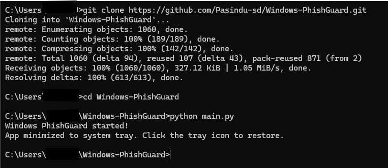

# Windows-PhishGuard

⚠️ License: Windows-PhishGuard is proprietary. You may view the code, but copying, redistribution, or modification is strictly prohibited.


that help to detect email phishing and url phishing

### Structure:

```
  phishguard/
├─ detectors/
│  ├─ __init__.py
│  ├─ email_detector.py
│  └─ url_detector.py
├─ services/
│  ├─ clipboard_watcher.py
│  └─ outlook_reader.py   # optional
├─ storage/
│  └─ db.py               # SQLite helper
├─ gui.py
├─ main.py                # CLI & glue
├─ requirements.txt
└─ README.md
```

A powerful and intuitive Windows application designed to proactively detect and alert users about potential phishing websites, helping to safeguard your personal information and credentials from online threats.


---
```
                                   [o]     Under Development Project      [o]
```
---

---

## Overview

**Windows PhishGuard** is a desktop security tool that acts as your first line of defense against phishing attacks. By analyzing websites in real-time, it checks URLs against known phishing databases and uses heuristic analysis to identify suspicious patterns, warning you before you enter any sensitive data.

Phishing is one of the most common cyber threats, and this tool aims to provide an additional layer of security for everyday Windows users.

---

## Features

- Real-time URL Analysis**: Automatically scans URLs you visit in your browser.
- Instant Alerts**: Displays clear, non-intrusive pop-up warnings for suspected phishing sites.
- Heuristic Checks**: Goes beyond blocklists to analyze page content, domain age, and SSL certificate status for suspicious characteristics.
- Community Blocklists**: Integrates with and updates from reputable, crowdsourced phishing and malware domain lists.
- Low System Impact**: Designed to be lightweight and run efficiently in the background.
- User-Friendly Interface**: Simple settings panel to configure sensitivity and view detection history.

---

## Getting Started

### Prerequisites

- **Operating System**: Windows 10 or Windows 11.
- **.NET Framework**: Ensure you have the latest .NET Desktop Runtime (or the version specified in the build) installed. [Download here if needed](https://dotnet.microsoft.com/download/dotnet).

### Installation

1.  Go to the [Releases](https://github.com/Pasindu-sd/Windows-PhishGuard/releases) page of this repository.
2.  Download the latest `Windows-PhishGuard-Setup.exe` file.
3.  Run the installer and follow the on-screen instructions.
4.  Launch **Windows PhishGuard** from your Start Menu.

*(Note: As the project is under development, the release might not be available yet. Check back soon!)*

---

### Building from Source

If you want to build the application yourself:

1.  **Clone the repository:**
    ```bash
    git clone https://github.com/Pasindu-sd/Windows-PhishGuard.git
    cd Windows-PhishGuard
    pip install -r requirements.txt
    python main.py
    ```

2.  **Open the Solution:**
    Open the `.sln` file in Visual Studio 2022 or later.

3.  **Restore NuGet Packages:**
    The package restore should happen automatically. If not, right-click the solution in Solution Explorer and select "Restore NuGet Packages."

4.  **Build & Run:**
    Press `F5` or select "Build Solution" from the Build menu.


    Sample :

    

---


## Usage

Once installed and running, Windows PhishGuard will sit quietly in your system tray (notification area).

- It will automatically monitor your web traffic.
- If a potential phishing site is detected, a warning notification will appear.
- You can right-click the system tray icon to:
    - **Pause/Resume** protection.
    - **View** the detection log.
    - **Open** the settings window.
    - **Exit** the application.

---
