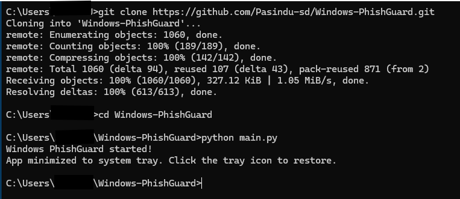

# Windows-PhishGuard


Windows-PhishGuard is a desktop phishing defense tool for Windows that combines:

- Real-time URL reputation checks
- Rule-based phishing detection
- ML-based URL classification
- Email content and header spoofing analysis
- Clipboard and browser monitoring with alerts

## What Is New

- Real-time URL scanning now includes Google Safe Browsing API reputation checks.
- Email analysis now includes header spoofing detection (From, Reply-To, Return-Path, Received, SPF/DKIM/DMARC signals).

## Features

- URL detection pipeline: Google Safe Browsing + local rules + ML model.
- Real-time protection for copied links and browser-discovered URLs.
- Email phishing checks for suspicious wording, urgency patterns, and risky domains.
- Email spoofing checks for sender/authentication mismatches.
- Local scan history with export support.
- Optional IMAP inbox auto-monitoring.

## Screenshots

### Main App Window



### URL and Email Scanning


### Scan History and Alerts


Note: Replace the sample images above with your latest UI captures as the app evolves.

## Requirements

- Windows 10 or Windows 11
- Python 3.11+

Install dependencies:

```bash
pip install -r requirements.txt
```

## Quick Start

```bash
git clone https://github.com/Pasindu-sd/Windows-PhishGuard.git
cd Windows-PhishGuard
pip install -r requirements.txt
python main.py
```

## Google Safe Browsing Setup (Free Tier)

1. Open Google Cloud Console.
2. Enable Safe Browsing API.
3. Create an API key.
4. Set one of these environment variables before launching the app:

```powershell
$env:GOOGLE_SAFE_BROWSING_API_KEY="your_api_key_here"
python main.py
```

Or:

```powershell
$env:SAFE_BROWSING_API_KEY="your_api_key_here"
python main.py
```

If no API key is configured, the app still works using local rule/ML URL checks.

## Email Spoofing Header Analysis

Header checks include:

- From vs Return-Path mismatch
- Reply-To mismatch
- From vs Received path mismatch
- SPF/DKIM/DMARC fail indicators in Authentication-Results
- Brand impersonation patterns in sender headers

These checks are used in both:

- Manual email scans (including pasted raw header blocks)
- Auto IMAP monitoring mode

## Configuration

- Email settings are stored in email_config.json from the Email Configuration tab.
- Runtime phishing patterns can be updated from phishing_rules.json.

## Disclaimer

- Use only in authorized, legal, and controlled environments.
- This project is under active development and behavior may change.

## License

Windows-PhishGuard is proprietary. Viewing source is allowed, but copying, redistribution, and modification are restricted by the project owner.
